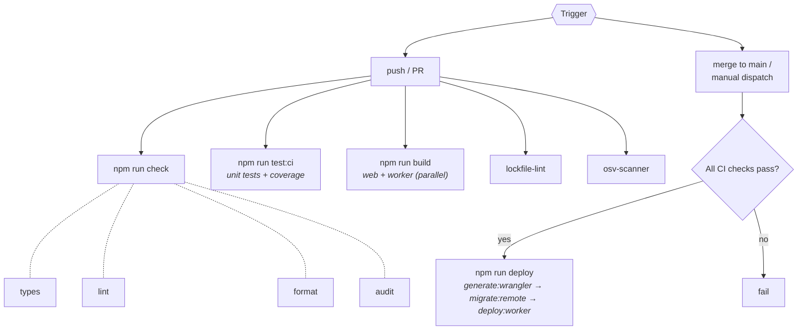
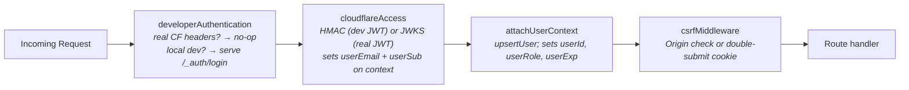

# CF-Architect v2 — Implementation Plan

> This document is the long-lived engineering reference for the CF-Architect v2 build.
> See [REQUIREMENTS.md](./REQUIREMENTS.md) for full user stories, personas, and design notes.
> See [plan/](./plan/) for per-phase task lists.

---

## 1. Overview

CF-Architect v2 is a visual architecture design tool purpose-built for Cloudflare. Users design
architectures on a graph canvas, drawing from a comprehensive catalog of Cloudflare services, share
diagrams via read-only links, export them as images or ready-to-run project scaffolds, and manage
them across a dashboard — all within a secure, multi-user environment built entirely on the
Cloudflare developer platform.

---

## 2. Tech Stack

| Concern               | Choice                                                                                    | Rationale                                                                                 |
| --------------------- | ----------------------------------------------------------------------------------------- | ----------------------------------------------------------------------------------------- |
| **Frontend bundler**  | Vite + React 19 + TypeScript (strict)                                                     | SPA on Worker ASSETS; fast HMR; modern toolchain                                          |
| **Routing**           | TanStack Router                                                                           | Type-safe file-based routes; best DX for typed params                                     |
| **Canvas**            | @xyflow/react (React Flow v12+)                                                           | De-facto node-based editor; custom node/edge renderers; accessible                        |
| **Auto-layout**       | elkjs in a Web Worker                                                                     | Spec requires off-main-thread layout (F4-US9)                                             |
| **Client state**      | Zustand + zundo (temporal middleware)                                                     | Tiny; undo/redo-friendly; no boilerplate                                                  |
| **Server state**      | TanStack Query                                                                            | Caching; optimistic updates; autosave coordination                                        |
| **Worker framework**  | Hono                                                                                      | Required by `@adrianhall/cloudflare-auth`; lightweight; also a scaffold template (F9)     |
| **Validation**        | Zod v4                                                                                    | Shared between client/worker/MCP; single source of truth for all schemas                  |
| **ORM**               | Drizzle on D1                                                                             | Type-safe; spec explicitly mentions it (F9-US4)                                           |
| **Primary storage**   | D1 (metadata + JSON blob)                                                                 | Simple; most diagrams <64 KB; optimistic-concurrency via `version` column                 |
| **Object storage**    | R2                                                                                        | Diagram thumbnails; large blob overflow                                                   |
| **Cache**             | KV                                                                                        | Share-token lookup; catalog ETag; edge-local performance                                  |
| **Thumbnails**        | Client-side canvas→PNG→R2                                                                 | Free; accurate; no server-side rendering cost                                             |
| **Icon system**       | Cloudflare brand SVG sprite + `<ServiceIcon>` component                                   | Single component; no inline-SVG drift; accessible                                         |
| **Unit tests**        | Vitest + @cloudflare/vitest-pool-workers                                                  | First-class Cloudflare tooling for Worker code                                            |
| **E2E tests**         | Playwright                                                                                | Standard for canvas/keyboard testing                                                      |
| **A11y tests**        | @axe-core/playwright                                                                      | Zero serious/critical violations required on every page                                   |
| **Lint**              | ESLint 10 flat config: `@eslint/js` + `typescript-eslint` + `@eslint-react/eslint-plugin` | TS-aware React linting per <https://www.eslint-react.xyz/docs/getting-started/typescript> |
| **Format**            | Prettier                                                                                  |                                                                                           |
| **Pre-commit**        | Husky + lint-staged                                                                       |                                                                                           |
| **Commit convention** | Conventional Commits + commitlint                                                         |                                                                                           |
| **Script runner**     | npm-run-all2                                                                              | Parallel/sequential npm script composition                                                |
| **CI**                | GitHub Actions                                                                            | Lint, type-check, test, build, deploy                                                     |
| **Infrastructure**    | Terraform with cloudflare/cloudflare v5 + jrhouston/dotenv                                | Secrets read from `.env`; idempotent provisioning                                         |
| **Auth**              | @adrianhall/cloudflare-auth (Hono middleware)                                             | Cloudflare Access JWT; interactive dev-mode login bypass                                  |
| **Scaffold ZIP**      | @zip.js/zip.js                                                                            | Client-side ZIP; no native bindings; supply-chain friendly                                |

### Supply-chain hardening decisions

- Keep TanStack Router and TanStack Query (no known compromise; hardening mitigates the class of risk).
- `ignore-scripts=true` globally; tiny postinstall allowlist in `scripts/postinstall.mjs`.
- Renovate with `minimumReleaseAge: "14d"` cooldown.
- `npm audit --audit-level=high` + `npm audit signatures` + OSV-Scanner in CI.
- GitHub Dependabot security alerts enabled.
- No paid third-party scanning tools (Dependabot + npm audit is sufficient for this project).
- Supply-chain detail: see §9 below.

---

## 3. Repository Layout

```text
/
├── .env.example                  # All required environment variables (documented, no values)
├── .dev.vars.example             # Local-only vars (DEV_MODE, etc.) — never committed
├── .npmrc                        # ignore-scripts=true; engine-strict=true
├── .renovaterc.json              # 14-day cooldown; Dependabot security bypass
├── package.json                  # npm workspaces root; full script index
├── tsconfig.base.json            # Shared TS config (strict, paths)
├── eslint.config.ts              # Root ESLint flat config (all workspaces)
├── prettier.config.ts            # Prettier config
├── vitest.workspace.ts           # Vitest workspace config
├── playwright.config.ts          # Playwright + axe-core config
├── wrangler.template.jsonc       # Wrangler config template (${TF_OUTPUT_*} placeholders)
├── wrangler.jsonc                # Generated by render-wrangler; gitignored
│
├── infra/                        # Terraform
│   ├── main.tf                   # Provider declarations; dotenv data source
│   ├── d1.tf                     # D1 database
│   ├── kv.tf                     # KV namespaces (shares cache, catalog cache)
│   ├── r2.tf                     # R2 bucket (thumbnails)
│   ├── worker.tf                 # Cloudflare Worker resource
│   ├── access.tf                 # Cloudflare Access application + policy (optional)
│   ├── outputs.tf                # TF outputs consumed by render-wrangler.ts
│   └── variables.tf              # Input variable declarations
│
├── scripts/
│   ├── render-wrangler.ts        # Reads terraform output → substitutes wrangler.template.jsonc
│   ├── postinstall.mjs           # Allowlist runner for ignore-scripts=true
│   └── preview-env.ts            # Per-PR environment provisioning/teardown (Phase 02+)
│
├── packages/
│   └── shared/                   # Shared types, Zod schemas, catalog, i18n keys
│       ├── src/
│       │   ├── catalog/          # Service registry, categories, edge types, alias map
│       │   ├── schemas/          # Zod schemas: diagram, blueprint, API envelope
│       │   ├── templates/        # Scaffold template interface + built-in templates
│       │   └── messages/         # ICU message keys (en.json)
│       ├── package.json
│       └── tsconfig.json
│
├── apps/
│   ├── web/                      # Vite + React 19 SPA
│   │   ├── src/
│   │   │   ├── routes/           # TanStack Router file-based routes
│   │   │   ├── features/         # Per-phase feature folders (f01-foundations, f02-auth, …)
│   │   │   ├── components/       # Shared UI primitives
│   │   │   ├── hooks/            # Custom React hooks
│   │   │   ├── stores/           # Zustand stores
│   │   │   ├── lib/              # Utilities, API client (TanStack Query hooks)
│   │   │   ├── icons/            # Cloudflare SVG sprite + <ServiceIcon> component
│   │   │   └── styles/           # Global CSS, theme custom properties
│   │   ├── public/
│   │   ├── index.html
│   │   ├── vite.config.ts
│   │   ├── tsconfig.json
│   │   └── package.json
│   │
│   └── worker/                   # Hono Worker (API + ASSETS fallback)
│       ├── src/
│       │   ├── index.ts          # Entry: Hono app, middleware, ASSETS fallback
│       │   ├── routes/           # /api/* route groups (one file per feature)
│       │   ├── db/               # Drizzle schema, migrations, query helpers
│       │   │   ├── schema.ts
│       │   │   ├── migrations/
│       │   │   └── queries/
│       │   ├── middleware/       # auth.ts, csrf.ts, rate-limit.ts, logging.ts
│       │   └── lib/              # Worker-internal utilities
│       ├── tsconfig.json
│       └── package.json
│
├── e2e/                          # Playwright end-to-end specs
│   ├── specs/
│   └── helpers/                  # axe helper, auth helper
│
└── .github/
    └── workflows/
        ├── ci.yml                # On push/PR: check + test + build
        └── deploy.yml            # On main merge or manual dispatch
```

---

## 4. Build / Test / Deploy Flow

### First-time provisioning

1. `cp .env.example .env` — Fill in `CLOUDFLARE_ACCOUNT_ID`, `CLOUDFLARE_API_TOKEN`, …
2. `npm install` — Uses `npm ci` semantics; postinstall allowlist runs
3. `npm run provision` — `terraform init → terraform apply → generate:wrangler` (explicit `run-s` chain; generates `wrangler.jsonc`)
4. `npm run deploy` — `generate:wrangler → migrate:remote → deploy:worker` (explicit `run-s` chain)

### Subsequent deploys

```bash
npm run deploy
```

`npm run deploy` always regenerates `wrangler.jsonc`, applies any unapplied remote migrations, then
deploys the Worker. Migrations are idempotent — already-applied ones are skipped. This satisfies
F1-US5 (migrations never skipped, deploys safe to run repeatedly).

> **Note on `pre*`/`post*` hooks:** `.npmrc` sets `ignore-scripts=true` which also disables npm's
> automatic `predeploy`, `postprovision`, etc. auto-hooks. All sequencing in this project uses
> explicit `run-s` chains. Do not rely on npm lifecycle hooks.

### Local development

```bash
npm start    # runs: npm run build:web && wrangler dev
```

The Vite build output in `apps/web/dist/` is served as ASSETS. For hot-reloading UI changes during
development, run `npm run dev:web` (Vite dev server) and `npm run dev:worker` (wrangler dev) in
separate terminals; a proxy is configured in `vite.config.ts` for `/api/*`.

### CI pipeline



---

## 5. Environments

| Environment    | Wrangler env | D1                 | KV                 | R2                     | Auth                                        |
| -------------- | ------------ | ------------------ | ------------------ | ---------------------- | ------------------------------------------- |
| **Local**      | (default)    | miniflare local D1 | miniflare local KV | miniflare R2 emulation | `developerAuthentication` interactive login |
| **Production** | `production` | Production D1      | Production KV      | Production R2          | Cloudflare Access JWT                       |

No `DEV_MODE` flag is required. `@adrianhall/cloudflare-auth` detects real Cloudflare Access
headers automatically (no-ops when `Cf-Access-Jwt-Assertion` is present) and falls through to
the interactive email-login form in local development. See **D06** in `docs/DECISION_LOG.md`.

Production fails closed if `CLOUDFLARE_TEAM_DOMAIN` is unset and a real (non-dev) JWT is
presented, satisfying F2-US7.

> **Note — Per-PR preview environments (F1-US2):** Deferred from Phase 02. See **D03** in
> `docs/DECISION_LOG.md`.

---

## 6. Data Model Overview

### D1 Tables

| Table              | Purpose                        | Key columns                                                                                                       |
| ------------------ | ------------------------------ | ----------------------------------------------------------------------------------------------------------------- |
| `users`            | Authenticated user records     | `id` (CF sub), `email`, `name`, `avatar_url`, `role`, `created_at`, `last_login_at`                               |
| `admin_audit`      | Admin action history           | `id`, `actor_id`, `action`, `target_id`, `payload_json`, `at`                                                     |
| `diagrams`         | Diagram metadata + graph state | `id`, `owner_id`, `title`, `description`, `graph_json`, `thumbnail_r2_key`, `version`, `created_at`, `updated_at` |
| `blueprints`       | Curated blueprint store        | `id`, `slug`, `title`, `description`, `category`, `graph_json`, `published_at`, `author_id`                       |
| `shares`           | Share-link tokens              | `token`, `diagram_id`, `expires_at`, `revoked_at`, `created_at`, `created_by`                                     |
| `user_preferences` | Per-user settings              | `user_id`, `theme`, `palette_state_json`, `ai_panel_enabled`, `updated_at`                                        |

### KV Namespaces

| Namespace         | Purpose                     | TTL policy                        |
| ----------------- | --------------------------- | --------------------------------- |
| `CF_ARCH_SHARES`  | Share-token lookup cache    | `min(share.expires_at, now + 1h)` |
| `CF_ARCH_CATALOG` | Catalog response ETag cache | 24 hours                          |

### R2 Buckets

| Bucket           | Purpose            | Key pattern                             |
| ---------------- | ------------------ | --------------------------------------- |
| `cf-arch-assets` | Diagram thumbnails | `thumbnails/{diagram_id}/{version}.png` |

### Optimistic Concurrency

All `diagrams` writes use `WHERE id = $id AND owner_id = $userId AND version = $expectedVersion`.
If `rows_affected = 0`, the server returns `409 Conflict` with `{ "ok": false, "error": { "code": "CONFLICT", "conflict": true } }`.
The client shows "Another session saved changes — reload?" (Design Notes §Concurrency).

---

## 7. API Conventions

### Response envelope

```jsonc
// Success
{ "ok": true, "data": { /* ... */ }, "meta": { "requestId": "req_…" } }

// Error
{ "ok": false, "error": { "code": "DIAGRAM_NOT_FOUND", "message": "…", "details": {} } }
```

### Error codes

| Code              | HTTP | Meaning                                                 |
| ----------------- | ---- | ------------------------------------------------------- |
| `UNAUTHENTICATED` | 401  | No valid JWT                                            |
| `FORBIDDEN`       | 403  | Authenticated but not authorised                        |
| `NOT_FOUND`       | 404  | Resource absent or not visible to caller                |
| `CONFLICT`        | 409  | Optimistic-concurrency version mismatch                 |
| `UNPROCESSABLE`   | 422  | Validation failure; `details` contains Zod field errors |
| `RATE_LIMITED`    | 429  | Endpoint-level rate limit exceeded                      |
| `INTERNAL`        | 500  | Unexpected error; full error logged server-side only    |

### Rate limits

Rate limits are enforced by the native Cloudflare Workers `ratelimit` binding (GA Sept 2025).
Three bindings are declared in `wrangler.template.jsonc`: `RL_SHARES`, `RL_ADMIN`, `RL_AUTOSAVE`.
Limits are per Cloudflare location (not globally per user). See **D02** in `docs/DECISION_LOG.md`.

| Endpoint group                     | Binding       | Limit              |
| ---------------------------------- | ------------- | ------------------ |
| `POST /api/shares`                 | `RL_SHARES`   | 10 / 60 s per user |
| `GET /share/:token`                | _(Phase 07)_  | 60 / 60 s per IP   |
| `PUT /api/diagrams/:id` (autosave) | `RL_AUTOSAVE` | 30 / 60 s per user |
| `POST\|PATCH\|DELETE /api/admin/*` | `RL_ADMIN`    | 20 / 60 s per user |

### CSRF

All mutating endpoints (`POST`, `PUT`, `PATCH`, `DELETE`) require either:

- An `Origin` header matching the deployment domain, **or**
- A `X-CSRF-Token` header matching the double-submit cookie value.

Public endpoints (`GET /api/health`, `GET /api/version`, `GET /share/:token`) are exempt.

---

## 8. Authentication Architecture

`@adrianhall/cloudflare-auth` provides two Hono middleware functions configured with a shared
`PathPolicy[]` array. Public paths: `/api/health`, `/api/version`, `/_auth/.*`, `/share/.*`. All
other `/api/*` paths require authentication.



- **`developerAuthentication`** — detects real `Cf-Access-Jwt-Assertion` header and no-ops
  (production path). Without that header, serves an interactive email-login form at `/_auth/login`
  and issues a dev JWT (local development path). **No `DEV_MODE` flag required.**
- **`cloudflareAccess`** — verifies the JWT via HMAC first (for dev JWTs), then falls back to
  the Cloudflare JWKS endpoint (for real Access JWTs). Sets `c.get("userEmail")` and
  `c.get("userSub")` on the Hono context. Requires `CLOUDFLARE_TEAM_DOMAIN` **only** for real
  (non-dev) JWTs.
- **`attachUserContext`** — calls `upsertUser` (creates the user row on first login; promotes to
  admin only on first insert if email matches `SEED_ADMIN_EMAIL`). Decodes the JWT payload to
  extract `exp`. Sets `userId`, `userRole`, `userExp` on context.
- **`csrfMiddleware`** — validates `Origin` header or double-submit `CF_CSRF` cookie for all
  mutating requests (`POST`, `PUT`, `PATCH`, `DELETE`). Exempt: public paths and `GET/HEAD/OPTIONS`.

### Admin role

The first user whose email matches `SEED_ADMIN_EMAIL` is promoted to `role = 'admin'` when their
user row is **first inserted** (first-ever login). Re-logins update `last_login_at` only and never
overwrite `role`. See **D05** in `docs/DECISION_LOG.md`. All subsequent admin changes go through
the admin UI with full audit-log entries.

### Wrangler ASSETS routing

`wrangler.template.jsonc` configures:

```jsonc
"assets": {
  "directory": "./apps/web/dist",
  "not_found_handling": "single-page-application",
  "binding": "ASSETS",
  "run_worker_first": ["/api/*", "/_auth/*"]
}
```

---

## 9. Supply-Chain Security

Supply-chain hardening is foundational, implemented in Phase 01. Layer 1
(`ignore-scripts=true`) is **suspended during active development (Phases 01–11)** and will be
fully re-instated and audited in Phase 12. See `docs/plan/phase-12.md`.

### Layer 1 — Reproducible installs _(Layer 1a suspended until Phase 12)_

- `.npmrc`: `engine-strict=true` (active); `ignore-scripts=true` suspended — see Phase 12.
- `npm ci` everywhere (CI, Husky pre-commit, docs). Never `npm install` in automated contexts.
- `lockfile-lint` in CI: verifies every resolved URL is `https://registry.npmjs.org/`; fails on
  missing integrity hashes; fails on `git+` URLs unless explicitly allowlisted.

### Layer 2 — Postinstall allowlist

`scripts/postinstall.mjs` maintains an explicit allowlist of packages permitted to run build
steps (`npm rebuild <pkg>`). The initial allowlist contains only `esbuild`. The script runs
automatically as the root `postinstall` npm lifecycle hook. Any addition to the allowlist
requires a code-reviewed PR with written justification.

When `ignore-scripts=true` is re-instated in Phase 12, the allowlist runner must be called
explicitly after `npm ci` (documented in the Phase 12 tasks). Until then, it runs automatically.

### Layer 3 — Dependency update cooldown

Renovate is configured with:

- `minimumReleaseAge: "14d"` — a version published today is invisible to Renovate PRs for 14 days.
- Minor/patch updates grouped into a single weekly PR.
- Major updates get individual PRs with mandatory manual review.
- Dependabot security-advisory patches bypass the cooldown window and are expedited.

### Layer 4 — Automated scanning in CI

- `npm audit --audit-level=high` — blocks on high/critical CVEs.
- `npm audit signatures` — verifies sigstore-signed packages; rejects tampered packages not yet
  in the CVE database.
- GitHub Dependabot security alerts — enabled on the repository; free.
- OSV-Scanner — cross-checks the OSV.dev database as a second opinion.

### Layer 5 — GitHub-sourced dependency pinning

`@adrianhall/cloudflare-auth` is installed directly from GitHub and is pinned to a specific commit
SHA in `apps/worker/package.json`:

```json
"@adrianhall/cloudflare-auth": "github:adrianhall/cloudflare-auth#<sha>"
```

The SHA is bumped deliberately via a Renovate PR with manual review. Wildcards (`main`, `latest`,
branch names) are not used for any GitHub-sourced dependency.

### Layer 6 — SBOM + provenance evidence

- `npm sbom --sbom-format spdx` runs on every release build and is stored as a CI artefact.
- Deploy logs record `sha256sum package-lock.json` so any post-incident review can answer "which
  exact lockfile was active for deploy X?"

### Layer 7 — Runtime hardening (Worker)

- **Strict CSP**: `default-src 'self'; script-src 'self'; connect-src 'self'` (extended in Phase 11
  to include AI Gateway). A compromised bundled dependency cannot beacon out.
- **No CDN-loaded JS**: every third-party library goes through the Vite bundler. No
  `<script src="cdn.example.com/…">` ever.
- **Separate API tokens**: the `provision` token has broad Terraform permissions; the `deploy`
  token is scoped to `Workers Scripts:Edit` only. A build-time token leak cannot mutate
  infrastructure.

### Layer 8 — Developer hygiene (documented in README)

- Run `npm ci` inside a devcontainer or clean shell to prevent postinstall scripts touching
  developer home directories.
- Store `.env` secrets in a secrets manager (1Password, etc.), not in dotfiles or shell history.

---

## 10. Accessibility

Accessibility is a first-class requirement, not a post-launch concern.

- Full keyboard-only operability on every page including the canvas.
- Visible focus indicators on all interactive elements.
- Accessible names (`aria-label` or visible label) on all icon buttons.
- Screen-reader landmark regions (`<main>`, `<nav>`, `<aside>`) on every page.
- `prefers-reduced-motion` disables edge animations and auto-layout transition effects.
- `prefers-color-scheme` sets the default theme.
- High-contrast theme variant provided.
- `@axe-core/playwright` integrated in CI. Zero serious or critical violations required to pass.
  Axe checks run against: dashboard, canvas editor, admin panel, share-link viewer, print view.

---

## 11. Internationalisation

- All user-facing strings are externalised into `packages/shared/src/messages/en.json` in ICU
  message format.
- The app ships English-only at launch.
- Component layouts must tolerate ±40% translation length variance to enable future translations
  without UI refactoring.
- No hard-coded English strings in component JSX; every display string references a message key.
- Translation tooling infrastructure is in place from Phase 01; actual translations are out of
  scope for v2.

---

## 12. Script Reference

All npm scripts follow a consistent `{verb}:{scope}` pattern. `npm-run-all2` composes them.

### Root `package.json` scripts

```jsonc
{
  "scripts": {
    // Build
    "build": "npm-run-all2 --sequential build:web build:worker",
    "build:web": "npm run build --workspace=apps/web",
    "build:worker": "npm run build --workspace=apps/worker",

    // Check (non-destructive; sequential for easy diagnostic reading)
    "check": "npm-run-all2 --sequential check:types check:lint check:format check:audit",
    "check:types": "tsc --build --noEmit",
    "check:lint": "eslint .",
    "check:format": "prettier --check .",
    "check:audit": "npm audit --audit-level=high && npm audit signatures",

    // Fix (auto-correct; sequential for easy diagnostic reading)
    "fix": "npm-run-all2 --sequential fix:lint fix:format",
    "fix:lint": "eslint --fix .",
    "fix:format": "prettier --write .",

    // Test — all Vitest projects (web, shared, worker) run together with Istanbul coverage.
    // @cloudflare/vitest-pool-workers requires Istanbul; V8 coverage is not supported in the
    // Workers runtime. Coverage is collected on every test:unit run automatically.
    "test": "npm-run-all2 --sequential test:unit test:e2e",
    "test:unit": "vitest run --project web --project shared --project worker --coverage",
    "test:e2e": "playwright test",
    "test:a11y": "playwright test --grep @a11y",
    "test:ci": "npm-run-all2 --sequential test:unit",

    // Dev / deploy
    // All multi-step sequences use explicit run-s chains for transparency.
    "start": "run-s build:web dev:worker",
    "dev:web": "npm run dev --workspace=apps/web",
    "dev:worker": "run-s migrate:local dev:worker:serve",
    "dev:worker:serve": "wrangler dev --config wrangler.test.jsonc",
    "provision": "run-s provision:init provision:apply generate:wrangler",
    "provision:init": "terraform -chdir=infra init",
    "provision:apply": "terraform -chdir=infra apply",
    "generate:wrangler": "tsx scripts/render-wrangler.ts",
    "migrate:local": "wrangler d1 migrations apply DB --local --config wrangler.test.jsonc",
    "migrate:remote": "wrangler d1 migrations apply DB --remote --config wrangler.jsonc",
    "deploy": "run-s generate:wrangler migrate:remote deploy:worker",
    "deploy:worker": "wrangler deploy --config wrangler.jsonc",
    "teardown": "run-s teardown:destroy teardown:cleanup",
    "teardown:destroy": "terraform -chdir=infra destroy",
    "teardown:cleanup": "rimraf wrangler.jsonc .terraform-outputs.json",
    "clean": "rimraf dist apps/web/dist apps/worker/dist coverage .wrangler playwright-report test-results",
  },
}
```

### Workspace scripts (pattern)

Each workspace (`apps/web`, `apps/worker`, `packages/shared`) exposes the same verb-scoped names so
root scripts can delegate via `--workspace=` flags or `vitest --project` selectors:

```jsonc
// apps/web/package.json
{
  "scripts": {
    "build": "vite build",
    "dev": "vite",
    "check:types": "tsc --noEmit",
    "test:unit": "vitest run"   // invoked by root via --project web
  }
}

// apps/worker/package.json
{
  "scripts": {
    "build": "wrangler deploy --dry-run --outdir dist",
    "check:types": "tsc --noEmit",
    "test:unit": "vitest run"   // invoked by root via --project worker
  }
}
```

> Worker tests are included in the root `test:unit` run (`--project worker`), not in a
> separate `test:worker` script. Istanbul is the required coverage provider for all projects
> because `@cloudflare/vitest-pool-workers` does not support V8 coverage.

### Verb semantics

| Verb                | Meaning                                              | Destructive?                   |
| ------------------- | ---------------------------------------------------- | ------------------------------ |
| `build`             | Compile/bundle for production                        | No                             |
| `check`             | Non-destructive validation                           | No                             |
| `fix`               | Auto-correct lint + format                           | Yes (modifies files)           |
| `test`              | Run automated test suites                            | No                             |
| `dev` / `start`     | Local development server                             | No                             |
| `provision`         | `terraform init → apply → generate:wrangler`         | Yes (creates cloud resources)  |
| `generate:wrangler` | Generate `wrangler.jsonc` from TF outputs            | Yes (writes file)              |
| `migrate:local`     | Apply Drizzle migrations to local D1                 | Yes (mutates local database)   |
| `migrate:remote`    | Apply Drizzle migrations to remote D1                | Yes (mutates production DB)    |
| `deploy`            | `generate:wrangler → migrate:remote → deploy:worker` | Yes (mutates production)       |
| `teardown`          | `terraform destroy` + remove generated files         | Yes (destroys cloud resources) |
| `clean`             | Remove all build artefacts and local state           | Yes (deletes local files/dirs) |

---

## 13. Phase Index

| #                        | Title                                     | Source | Status  | Depends On |
| ------------------------ | ----------------------------------------- | ------ | ------- | ---------- |
| [01](./plan/phase-01.md) | Platform Foundations                      | F1     | Planned | —          |
| [02](./plan/phase-02.md) | Identity, Access & Multi-User             | F2     | Planned | 01         |
| [03](./plan/phase-03.md) | Cloudflare Service Catalog                | F3     | Planned | 01         |
| [04](./plan/phase-04.md) | Architecture Canvas                       | F4     | Planned | 02, 03     |
| [05](./plan/phase-05.md) | Diagram Lifecycle                         | F5     | Planned | 04         |
| [06](./plan/phase-06.md) | Blueprints & Templates                    | F6     | Planned | 05         |
| [07](./plan/phase-07.md) | Sharing & Read-Only View                  | F7     | Planned | 05         |
| [08](./plan/phase-08.md) | Export & Print                            | F8     | Planned | 04         |
| [09](./plan/phase-09.md) | Project Scaffold Export                   | F9     | Planned | 03, 08     |
| [10](./plan/phase-10.md) | MCP Server _(post-MVP)_                   | F10    | Planned | 09         |
| [11](./plan/phase-11.md) | In-App AI Architect Chat _(post-MVP)_     | F11    | Planned | 10         |
| [12](./plan/phase-12.md) | Security Hardening & Production Readiness | SEC    | Planned | 01–11      |

---

## 14. Glossary

| Term                      | Definition                                                                                  |
| ------------------------- | ------------------------------------------------------------------------------------------- |
| **Diagram**               | A user-owned graph of Cloudflare service nodes and connecting edges                         |
| **Blueprint**             | A curated, read-only reference diagram published by a blueprint author                      |
| **Share**                 | A token-protected read-only link to a diagram                                               |
| **Service**               | An entry in the Cloudflare service catalog (e.g. "Workers KV", "D1")                        |
| **Category**              | A grouping of services with a shared colour (e.g. "Storage", "Compute")                     |
| **Edge type**             | One of four connection styles: `data-flow`, `binding`, `dependency`, `logical`              |
| **Scaffold**              | A downloadable ZIP containing a ready-to-run Wrangler project derived from a diagram        |
| **DEV_MODE**              | A `.dev.vars`-only flag enabling the interactive developer login bypass                     |
| **Envelope**              | Standard JSON response wrapper: `{ ok, data, meta }` or `{ ok, error }`                     |
| **Version**               | Optimistic-concurrency integer on each diagram row; increments on every save                |
| **Thumbnail**             | A PNG preview of a diagram's canvas, generated client-side and stored in R2                 |
| **Postinstall allowlist** | The set of packages explicitly permitted to run build scripts via `scripts/postinstall.mjs` |
